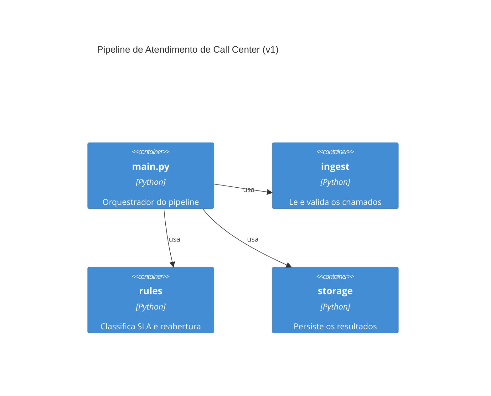

# Etapa 5 — Diagrama de arquitetura (versão 1)

Gerado a partir de um prompt simples, com pouco contexto: "gere um diagrama
Mermaid C4 de contêiner para este pipeline Python com módulos ingest, rules
e storage".

**Limitação percebida:** trata `rules` como um bloco único, escondendo que
`dedup.py`, `sla.py`, `urgencia.py` e `resumo.py` são independentes entre
si — e não mostra o CSV de entrada nem o banco SQLite como elementos
externos ao sistema, que é justamente o que o nível C4 de contêiner deveria
deixar explícito.
