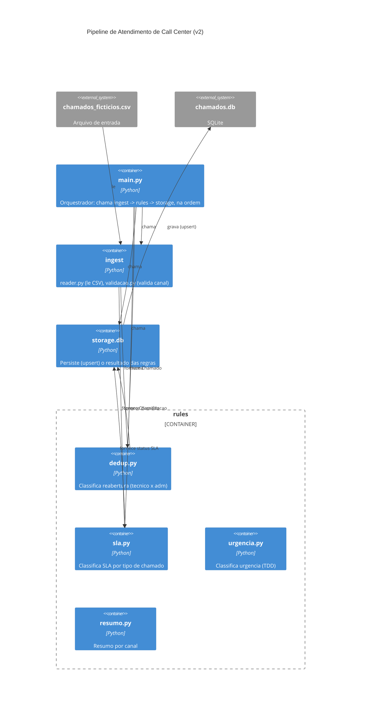

# Etapa 5 — Diagrama de arquitetura (versão 2)

Gerada com um prompt com **mais contexto**: pedindo explicitamente para
incluir o CSV de entrada e o banco SQLite como elementos externos ao
sistema (nível C4 de contêiner correto), mostrar os 4 módulos de `rules/`
separadamente (já que são independentes entre si, conforme Etapa 4), e
indicar a direção real do fluxo de dados.

## Comparação escrita entre as duas versões
A **v1** comunica rápido a ideia geral (3 blocos, 1 orquestrador), mas
esconde justamente o ponto mais importante da decisão arquitetural da
Etapa 4: que as regras dentro de `rules/` são independentes entre si. Ela
também trata o CSV e o banco como implícitos, quando o nível C4 de
contêiner deveria deixá-los explícitos como elementos externos ao sistema.

A **v2** comunica melhor a arquitetura real: mostra o baixo acoplamento
entre os módulos de regra (suportando o ADR 0001 — não há motivo para
extrair serviço, pois os módulos já são independentes e pequenos), deixa
explícito o contrato de entrada/saída (CSV → `Chamado` → SQLite), e reflete
com mais fidelidade o próprio código (`git log`/imports reais checados na
Etapa 4). Fica mais verboso, mas para documentação de arquitetura — que
deve durar além da memória de quem escreveu o código — a v2 é a versão
que eu manteria.

**Versão escolhida para o projeto: v2.**
